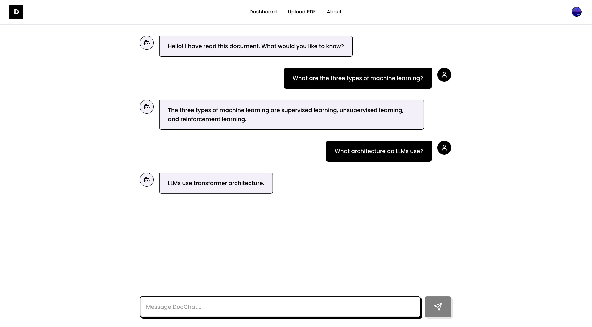
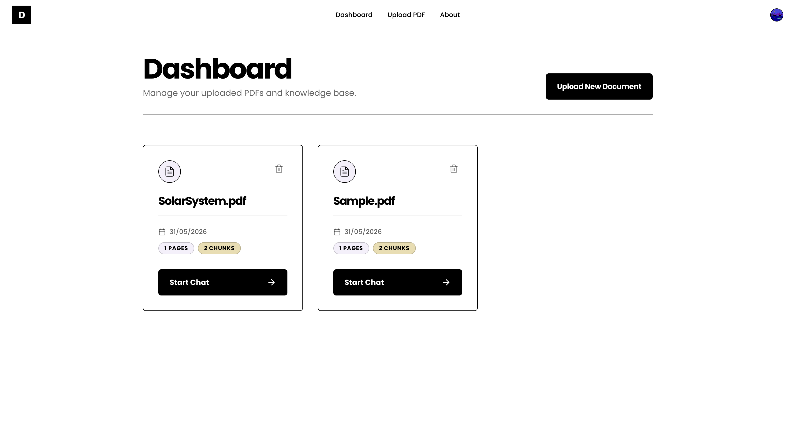
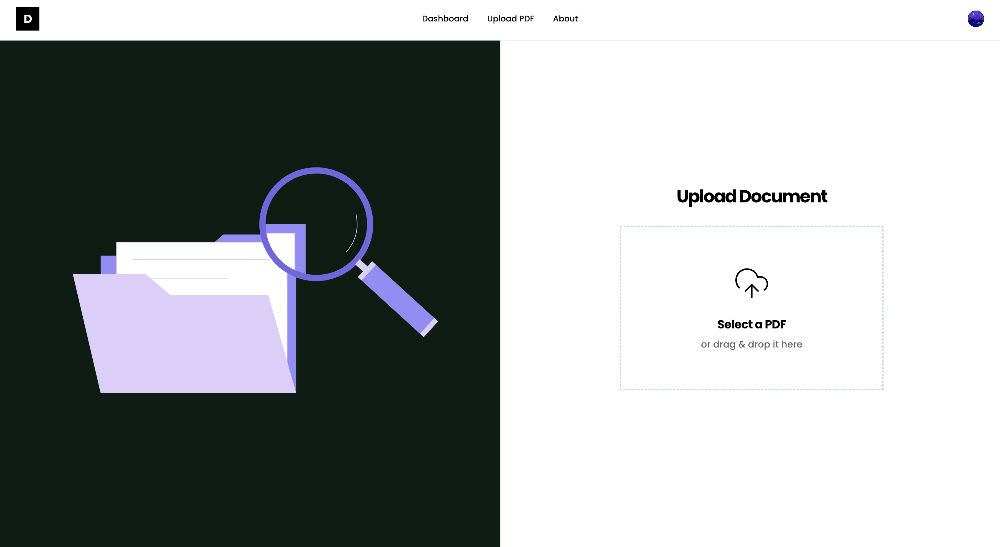

# DocChat

<p align="center">
  
  
  
</p>

DocChat is a modern, neo-brutalist web application that transforms static PDFs into interactive knowledge bases. Built with cutting-edge AI, it allows students, researchers, and professionals to seamlessly extract insights, summarize dense texts, and query specific clauses without manually skimming through pages.

## Features

- **AI-Powered Extraction**: Powered by Google's Gemini LLM, DocChat understands the semantic context of your questions and pulls exact answers directly from the source material.
- **Lightning Fast Search**: Utilizes Pinecone vector search for milliseconds-fast document querying and context retrieval.
- **Secure Storage**: Documents are securely managed. Authentication is handled robustly via Clerk.
- **Neo-Brutalist UI**: Features a striking, high-contrast, premium design system built with Tailwind CSS, custom Google Fonts (Poppins), and smooth Lottie animations.

## Tech Stack

**Frontend:**
- React 19 (Vite)
- Tailwind CSS v4
- Clerk (Authentication)
- Lottie-player
- Lucide React (Icons)
- React Dropzone

**Backend:**
- Node.js & Express
- Prisma (ORM) with PostgreSQL (Neon/Supabase)
- Google Generative AI (Gemini-1.5-flash)
- Pinecone (Vector Database)
- Multer & pdf-parse (File processing)

## Getting Started

### Prerequisites
- Node.js (v18+)
- Postgres Database
- Pinecone API Key & Environment
- Google Gemini API Key
- Clerk Publishable & Secret Keys

### Setup

1. **Clone the repository:**
   ```bash
   git clone https://github.com/Saneajayy/DocChat.git
   cd DocChat
   ```

2. **Install dependencies:**
   You will need to install dependencies for both the client and the server.
   ```bash
   # Install server dependencies
   cd server
   npm install

   # Install client dependencies
   cd ../client
   npm install
   ```

3. **Configure Environment Variables:**
   Create a `.env` file in both the `server` and `client` directories using their respective `.env.example` templates.

   **Server (`server/.env`):**
   ```env
   DATABASE_URL="your_postgres_url"
   GEMINI_API_KEY="your_google_genai_key"
   PINECONE_API_KEY="your_pinecone_key"
   PINECONE_ENVIRONMENT="your_pinecone_env"
   PINECONE_INDEX="docchat"
   CLERK_SECRET_KEY="your_clerk_secret"
   PORT=5000
   ```

   **Client (`client/.env`):**
   ```env
   VITE_CLERK_PUBLISHABLE_KEY="your_clerk_publishable_key"
   VITE_API_URL="http://localhost:5000"
   ```

4. **Initialize Database:**
   ```bash
   cd server
   npx prisma generate
   npx prisma db push
   ```

5. **Run the Application Locally:**
   Run both the client and server development scripts in separate terminals:
   
   *Terminal 1 (Backend):*
   ```bash
   cd server
   npm run dev
   ```
   
   *Terminal 2 (Frontend):*
   ```bash
   cd client
   npm run dev
   ```

## License
MIT License
